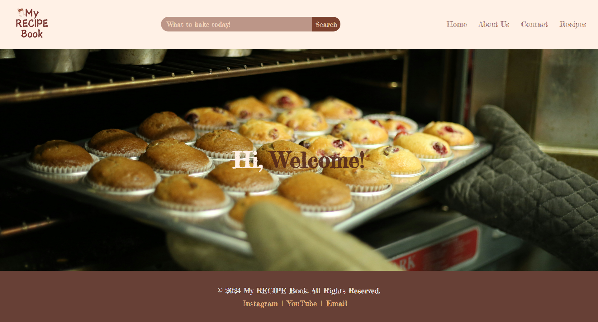

## Custom Theme Development: **_Food Blog_**

### Important Points

While adding recipes, ensure to use the following **_Name_** values. These are the only ones displayed on the front-end:

- **information**
- **ingredients**
- **prepare**

The **_*ingredients*_** field values should be separated by a new line. The **_*prepare*_** (i.e., steps) should be separated by a period (".")

Templates for **_About Us_** and **_Contact Us_** are available and all pages are customisable(featured images and text)

Site logo is directly configured by setting site icon in settings

---

### Reference Image

---

### Preview

---

### **_Optional :_** To enhance functionality this theme can be used along with the plugin [here](https://github.com/aasthaanand123/custom-plugin-development)
